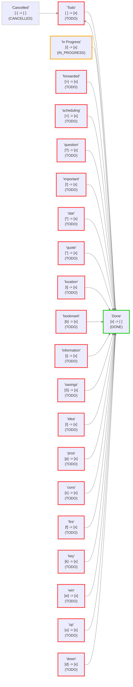

# Tasks Plugin - 상태 검토 및 확인 2025-10-24 20-41-47

이 파일은 이 보관소(vault)의 작업 상태를 시각화하는 데 도움을 주기 위해 Obsidian Tasks 플러그인(버전 7.22.0)이 생성했습니다.

Tasks 상태 설정을 변경했다면, 다음 방법으로 보고서를 업데이트할 수 있습니다:

- `설정(Settings)` → `Tasks`로 이동합니다.
- `상태 검토 및 확인(Review and check your Statuses)`을 클릭합니다.

이 파일은 언제든지 삭제할 수 있습니다.

## 상태 설정

<!--
표를 보려면 실시간 미리보기 또는 읽기 모드로 전환하세요.
상태 이름에 '*'나 '_'와 같은 마크다운(Markdown) 서식 문자가 포함된 경우,
Obsidian은 읽기 모드에서만 표를 올바르게 렌더링할 수 있습니다.
-->

코어(Core) 및 사용자 정의(Custom) 상태 섹션의 상태 값입니다.

| 상태 기호   | 다음 상태 기호 | 상태 이름       | 상태 유형         | 문제점 (있는 경우)                    |
| ------- | -------- | ----------- | ------------- | ------------------------------ |
| `space` | `x`      | Todo        | `TODO`        |                                |
| `x`     | `space`  | Done        | `DONE`        |                                |
| `/`     | `x`      | In Progress | `IN_PROGRESS` |                                |
| `-`     | `space`  | Cancelled   | `CANCELLED`   |                                |
| `space` | `x`      | to-do       | `TODO`        | 중복된 기호 '`space`': 이 상태는 무시됩니다. |
| `/`     | `x`      | incomplete  | `IN_PROGRESS` | 중복된 기호 '`/`': 이 상태는 무시됩니다.     |
| `x`     | `space`  | done        | `DONE`        | 중복된 기호 '`x`': 이 상태는 무시됩니다.     |
| `-`     | `space`  | canceled    | `CANCELLED`   | 중복된 기호 '`-`': 이 상태는 무시됩니다.     |
| `>`     | `x`      | forwarded   | `TODO`        |                                |
| `<`     | `x`      | scheduling  | `TODO`        |                                |
| `?`     | `x`      | question    | `TODO`        |                                |
| `!`     | `x`      | important   | `TODO`        |                                |
| `*`     | `x`      | star        | `TODO`        |                                |
| `"`     | `x`      | quote       | `TODO`        |                                |
| `l`     | `x`      | location    | `TODO`        |                                |
| `b`     | `x`      | bookmark    | `TODO`        |                                |
| `i`     | `x`      | information | `TODO`        |                                |
| `S`     | `x`      | savings     | `TODO`        |                                |
| `I`     | `x`      | idea        | `TODO`        |                                |
| `p`     | `x`      | pros        | `TODO`        |                                |
| `c`     | `x`      | cons        | `TODO`        |                                |
| `f`     | `x`      | fire        | `TODO`        |                                |
| `k`     | `x`      | key         | `TODO`        |                                |
| `w`     | `x`      | win         | `TODO`        |                                |
| `u`     | `x`      | up          | `TODO`        |                                |
| `d`     | `x`      | down        | `TODO`        |                                |

## 로드된 설정

<!-- 다이어그램을 보려면 실시간 미리보기(Live Preview) 또는 읽기 모드(Reading Mode)로 전환하세요. -->

Tasks에서 실제로 사용 중인 설정입니다.




## 예시 작업

현재 사용 중인 각 상태에 대한 예시 작업입니다. 자유롭게 테스트해 보세요.

이 파일이 생성될 당시, 작업 설명에 포함된 상태 기호와 이름은 정확했습니다.

생성 후 예시 작업을 수정했다면, 아래 Tasks 검색의 그룹 제목에서 현재 상태 유형과 이름을 확인할 수 있습니다.

> [!Tip] 팁: 모든 체크박스가 똑같이 보인다면…
> 읽기 모드(Reading Mode) 또는 실시간 미리보기(Live Preview)에서 모든 체크박스가 동일하게 보인다면, [사용자 정의 상태 스타일링(Style custom statuses)](https://publish.obsidian.md/tasks/How+To/Style+custom+statuses) 문서를 참고하여 상태에 스타일을 적용할 테마나 CSS 스니펫을 선택하세요.
```
- [*] #task Sample task 1: status symbol=`space` status name='Todo'
- [x] #task Sample task 2: status symbol=`x` status name='Done'
- [x] #task Sample task 3: status symbol=`/` status name='In Progress' ✅ 2025-10-28
- [-] #task Sample task 4: status symbol=`-` status name='Cancelled'
- [>] #task Sample task 5: status symbol=`>` status name='forwarded'
- [<] #task Sample task 6: status symbol=`<` status name='scheduling'
- [?] #task Sample task 7: status symbol=`?` status name='question'
- [!] #task Sample task 8: status symbol=`!` status name='important'
- [*] #task Sample task 9: status symbol=`*` status name='star'
- ["] #task Sample task 10: status symbol=`"` status name='quote'
- [l] #task Sample task 11: status symbol=`l` status name='location'
- [b] #task Sample task 12: status symbol=`b` status name='bookmark'
- [i] #task Sample task 13: status symbol=`i` status name='information'
- [S] #task Sample task 14: status symbol=`S` status name='savings'
- [I] #task Sample task 15: status symbol=`I` status name='idea'
- [p] #task Sample task 16: status symbol=`p` status name='pros'
- [c] #task Sample task 17: status symbol=`c` status name='cons'
- [f] #task Sample task 18: status symbol=`f` status name='fire'
- [k] #task Sample task 19: status symbol=`k` status name='key'
- [w] #task Sample task 20: status symbol=`w` status name='win'
- [u] #task Sample task 21: status symbol=`u` status name='up'
- [d] #task Sample task 22: status symbol=`d` status name='down'
```
## 예시 작업 검색


이 Tasks 검색은 이 파일의 모든 작업을 상태 유형과 이름별로 그룹화하여 보여줍니다.

```tasks
path includes {{query.file.path}}
group by status.type
group by status.name
sort by function task.lineNumber
hide postpone button
short mode
```
